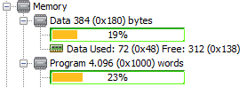

# Modbus for PIC16 Microchip microcontroller

This is a ANSI-C portable, small-footprint, serial-line (RTU) client implementation of [Modbus](https://en.wikipedia.org/wiki/Modbus) for the [8-bit PIC16 family](https://www.microchip.com/en-us/products/microcontrollers-and-microprocessors/8-bit-mcus/pic-mcus) of Microchip microcontrollers, with application limited to holding registries reads/writes.

On a [PIC16F1827](https://www.microchip.com/en-us/product/PIC16F1827) device, (with ~7Kb of program memory and 384 bytes of data memory), the library built with the free version of XC8, takes roughly 1/4 of the total resources.

# Samples

In addition to the bare library, the folder `samples` contains some sample code for simple applications.

More details can be found [here](./doc/samples.md).

# An HW implementation

My current prototype is a small board, made to fit in wall switches, with power regulator (3.3V or 5V), RS-485 adapter, and a micro-switch and LED.
It sports a `PIC16F1827` with nine general-purpose I/O ports and bus/supply pins available through a 0.1” header. 

More details can be found [here](./doc/microbean.md).
