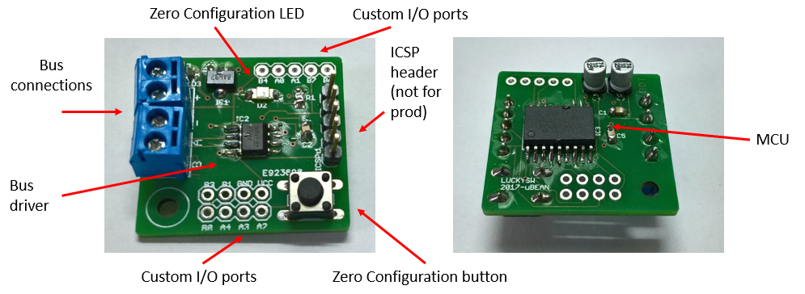

# Micro-bean prototype

The prototyped hardware is a small board (just 30x28mm) built around a cost-effective [Microchip PIC16F1827 MCU](https://www.microchip.com/wwwproducts/en/PIC16F1827), a RS-485 level adapter and a voltage regulator. The board expose almost all MCU lines to the maker, allowing a great amount of free digital and analog I/O pins.

# Schematic

The schematics is oriented to simplicity and stability.

The voltage regulation is delegated to a classic `78xx` series regulator, to be compatible with a wide range of line input voltage. A series diode saves the boards from inverted wiring. The electrolytic capacitors are oversized to comply with electric surges.

Since the regulated voltage is exposed through the output ports to power any attached hardware (sensors, small displays, etc...), the regulator should be dimensioned to provide the required current (depending also from the voltage swing of the power line).

Each boards can be indifferently fitted with 5V or 3.3V regulator, without any issue for the MCU that supports a wide input voltage. This enables a range of sensors to be directly connected to the MCU ports without requiring any level adapter.

A full-sized In-Circuit Serial Programmer for the MCU port is provided, with classic 0.1" pitch, to provide direct programming feature.

The RS485 bus adapter IC should be fitted based on the voltage regulator. Both voltage flavours are available from ST (`ST485`/`ST3485`).

The rest of the small board is occupied a micro-switch (that can be used as a reset or zero-configuration switch), the status LED, external connectors and the 4-wire screw-type terminals (power and RS485 bus).

# The Microcontroller

The selected MCU is the [PIC16L1827](https://www.microchip.com/wwwproducts/en/PIC16F1827) from Microchip, a mid-range 8-bit CPU with 4K-word program memory that gives a great selection of features in a small SO18 package that can be still soldered without requiring specialized tools.

In addition, pins can be configured with some degree of freedom in order to expose the hardware features as required.   

The following MCU lines are used to connect the bean to the RS485 bus, hence are not usually available for design:

- `RB2` as `UART RX`
- `RB5` as `UART TX`
- `RA6` for `RS485` line arbitration
- `RA5/MCLR` for reset/zero-configuration button
- `RA7` for status led

In addition these lines are shared with `ICSP`:
- `RB6` with `ICSP CLK`
- `RB7` with `ICSP DAT`

The configuration then leaves a total of 11 GPIO pins to the designer.
